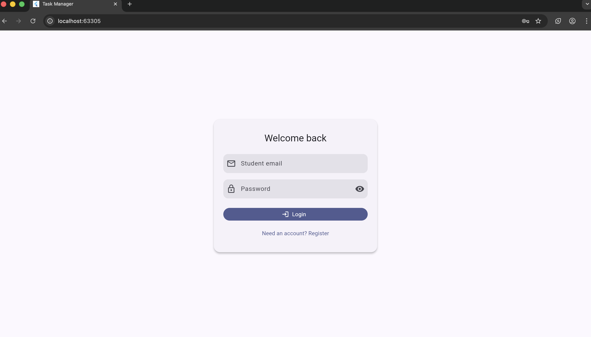
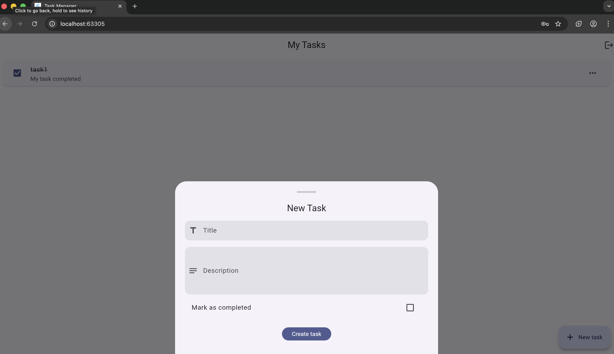
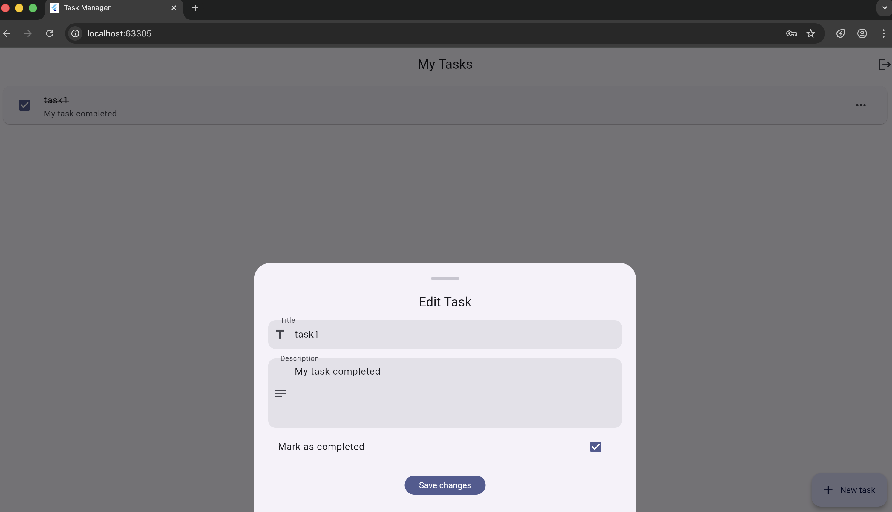

# Task Manager – Flutter + Back4App

A cross-platform task manager that uses Back4App (Parse Server) for authentication, data storage, and live updates. Students sign in with their school email, manage tasks in real time, and can safely log out without running any custom backend.

## Features
- Student-only login/registration (requires `.edu` emails) with Parse auth
- Create, read, update, and delete tasks tied to the logged-in user
- Real-time syncing powered by Parse LiveQuery – updates appear instantly
- Secure logout that clears the cached session on device

## Screenshots

<div align="center">
  
### Login Screen


### Registration Screen  


### Task List


### Create a new task


### Edit task


</div>

## Requirements
- Flutter 3.10+
- A Back4App application with REST + LiveQuery enabled

## Back4App Setup
1. Create a Parse Class named `Task`.
2. Add the following fields:
   - `title` – `String`
   - `description` – `String`
   - `isCompleted` – `Boolean`
   - `owner` – `Pointer<_User>`
3. Copy your Application ID, Client Key, REST URL, and LiveQuery URL.

## Environment Variables
1. Duplicate `.env.example` → `.env`.
2. Replace placeholders with your Back4App credentials:
   ```env
   PARSE_APPLICATION_ID=XXXXX
   PARSE_CLIENT_KEY=XXXXX
   PARSE_SERVER_URL=https://parseapi.back4app.com
   PARSE_LIVE_QUERY_URL=wss://your-app-id.b4a.io
   ```
3. The `.env` file stays local (it’s gitignored) but must exist so Flutter can load it as an asset.

## Running Locally
```bash
flutter pub get
flutter run
```
Pick the desired simulator or device when prompted.

## Testing
```bash
flutter test
```

## Project Structure
- `lib/core` – theming, env loader, validation helpers
- `lib/features/auth` – login/registration UI and controller
- `lib/features/tasks` – task list screen, editor sheet, task controller
- `lib/services` – Parse authentication, CRUD service, LiveQuery binding
- `docs/architecture.md` – high-level overview of the layers and data flow
